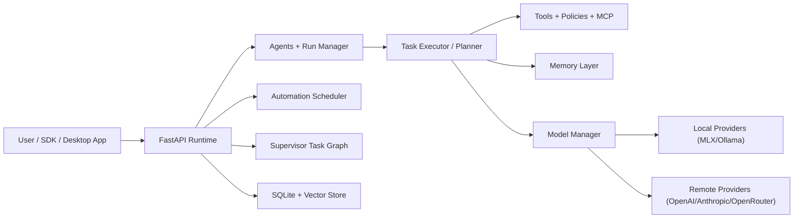

# Amaryllis

Amaryllis is an open-source, local-first AI runtime with a native macOS app.

It gives you one local node that can:
- serve an OpenAI-compatible API,
- run agent tasks,
- orchestrate automations,
- run multi-agent supervisor graphs,
- manage local/remote model routes,
- keep memory and telemetry on your machine by default.

## What You Can Do Today

- Use `POST /v1/chat/completions` with existing OpenAI-style clients.
- Create agents and run them in `plan` (dry-run) or `execute` mode.
- Schedule recurring automations (hourly, weekly, file-watch).
- Build bounded multi-agent DAG missions with Supervisor (`/supervisor/graphs/*`).
- Use memory + tools + plugin contracts with policy enforcement.
- Run with release/nightly quality gates for compatibility, security, SLO, and resilience.

## Platform Scope

- Primary: macOS (Apple Silicon), Python `3.11+`.
- Also supported: Linux runtime/service path.
- Native UI: SwiftUI app (`macos/AmaryllisApp`).

## Architecture (High Level)



## Quick Start (Backend, 10-15 min)

### 0) One-line install (optional)

From GitHub:

```bash
curl -fsSL https://raw.githubusercontent.com/apothecary-94/Amaryllis/main/scripts/install_macos.sh | bash
```

Linux runtime path:

```bash
curl -fsSL https://raw.githubusercontent.com/apothecary-94/Amaryllis/main/scripts/install_linux.sh | bash
```

If you work from a fork, replace `apothecary-94/Amaryllis` with your owner/repo.

### 1) Install dependencies

```bash
python3.11 -m venv .venv
source .venv/bin/activate
pip install -U pip
pip install -r requirements.lock
```

If you prefer the non-locked path:

```bash
pip install -r requirements.txt
```

### 2) Start runtime

```bash
export AMARYLLIS_SUPPORT_DIR="$HOME/.amaryllis-support"
export AMARYLLIS_AUTH_ENABLED=true
export AMARYLLIS_AUTH_TOKENS='dev-token:user-001:user'
export AMARYLLIS_COGNITION_BACKEND=deterministic

python -m uvicorn runtime.server:app --host 127.0.0.1 --port 8000 --reload
```

`deterministic` is the fastest bootstrap backend for local integration checks.

### 3) Verify health

```bash
curl -s http://127.0.0.1:8000/health
```

### 4) Send first OpenAI-compatible request

```bash
curl -X POST http://127.0.0.1:8000/v1/chat/completions \
  -H "Authorization: Bearer dev-token" \
  -H "Content-Type: application/json" \
  -d '{
    "messages": [
      {"role": "system", "content": "You are concise."},
      {"role": "user", "content": "Say hello from local runtime"}
    ],
    "stream": false
  }'
```

## Quick Start (Native macOS App)

```bash
cd macos/AmaryllisApp
./scripts/build_app.sh
open dist/Amaryllis.app
```

Optional DMG build:

```bash
./scripts/build_dmg.sh
```

## Simple User Flows

### 1) Create an agent

```bash
curl -X POST http://127.0.0.1:8000/agents/create \
  -H "Authorization: Bearer dev-token" \
  -H "Content-Type: application/json" \
  -d '{
    "name": "Research Agent",
    "system_prompt": "You are a practical research assistant.",
    "model": "mlx-community/Qwen2.5-1.5B-Instruct-4bit",
    "tools": ["web_search", "filesystem"],
    "user_id": "user-001"
  }'
```

### 2) Plan first, then execute

```bash
# dry-run planning (no execution)
curl -X POST http://127.0.0.1:8000/agents/<agent_id>/runs/dispatch \
  -H "Authorization: Bearer dev-token" \
  -H "Content-Type: application/json" \
  -d '{
    "user_id": "user-001",
    "session_id": "session-001",
    "message": "Investigate recurring failures and propose remediation",
    "interaction_mode": "plan"
  }'

# execute async run
curl -X POST http://127.0.0.1:8000/agents/<agent_id>/runs/dispatch \
  -H "Authorization: Bearer dev-token" \
  -H "Content-Type: application/json" \
  -d '{
    "user_id": "user-001",
    "session_id": "session-001",
    "message": "Investigate recurring failures and propose remediation",
    "interaction_mode": "execute"
  }'
```

### 3) Create an automation

```bash
curl -X POST http://127.0.0.1:8000/automations/create \
  -H "Authorization: Bearer dev-token" \
  -H "Content-Type: application/json" \
  -d '{
    "agent_id": "<agent_id>",
    "user_id": "user-001",
    "session_id": "session-001",
    "message": "Check repo updates and summarize",
    "schedule_type": "weekly",
    "schedule": {
      "byday": ["MO", "WE", "FR"],
      "hour": 9,
      "minute": 30
    },
    "timezone": "UTC",
    "start_immediately": false
  }'
```

### 4) Run a supervisor DAG mission

```bash
# create graph
curl -X POST http://127.0.0.1:8000/supervisor/graphs/create \
  -H "Authorization: Bearer dev-token" \
  -H "Content-Type: application/json" \
  -d '{
    "user_id": "user-001",
    "objective": "Triage, fix, and verify production incident",
    "nodes": [
      {"node_id": "triage", "agent_id": "<triage_agent_id>", "message": "Analyze root cause"},
      {"node_id": "fix", "agent_id": "<fix_agent_id>", "message": "Prepare remediation", "depends_on": ["triage"]},
      {"node_id": "verify", "agent_id": "<verify_agent_id>", "message": "Validate remediation", "depends_on": ["fix"]}
    ]
  }'

# launch and tick
curl -X POST http://127.0.0.1:8000/supervisor/graphs/<graph_id>/launch \
  -H "Authorization: Bearer dev-token" \
  -H "Content-Type: application/json" \
  -d '{"session_id":"session-001"}'

curl -X POST http://127.0.0.1:8000/supervisor/graphs/<graph_id>/tick \
  -H "Authorization: Bearer dev-token" \
  -H "Content-Type: application/json" \
  -d '{}'
```

## Security and Privacy Defaults

- Authentication is enabled by default.
- `GET /health` is public; protected endpoints require bearer token.
- Owner checks are enforced on agent/supervisor/automation resources.
- Local-first runtime: data remains local unless a tool/provider explicitly uses external services.
- Structured telemetry is local by default; OpenTelemetry export is opt-in.

## Repository Layout

```text
agents/         Agent lifecycle + async run manager
api/            HTTP API surface (chat/agents/automation/supervisor/model/...)
automation/     Scheduling and mission-policy overlays
kernel/         Core orchestration contracts/adapters
macos/          Native SwiftUI app
memory/         Working/episodic/semantic/profile memory
models/         Model manager and provider adapters
docs/           Contracts, gates, roadmap, operations playbooks
scripts/release Release/nightly gate scripts and report builders
tests/          Unit/contract/gate tests
```

## Development and Validation

Run a focused local gate pack:

```bash
python -m unittest \
  tests.test_api_lifecycle \
  tests.test_api_compatibility \
  tests.test_supervisor_task_graph_manager \
  tests.test_supervisor_mission_gate \
  -v

python scripts/release/api_compat_gate.py
python scripts/release/api_quickstart_compatibility_gate.py --output artifacts/api-quickstart-compat-report.json
```

For full quality gates, use the GitHub Actions workflows:
- `.github/workflows/release-gate.yml`
- `.github/workflows/security-gate.yml`
- `.github/workflows/nightly-reliability.yml`

## Documentation Map

Start here:
- [Developer quickstart](docs/developer-quickstart.md)
- [Roadmap](docs/amaryllis-roadmap.md)

Core contracts:
- [API lifecycle](docs/api-lifecycle.md)
- [Supervisor task graph](docs/supervisor-task-graph-contract.md)
- [Automation mission policy](docs/automation-mission-policy.md)
- [Flow session contract](docs/flow-session-contract.md)
- [Plugin compatibility contract](docs/plugin-compat-contract.md)

Operations and release:
- [Release playbook](docs/release-playbook.md)
- [Release quality dashboard](docs/release-quality-dashboard.md)
- [Observability and SRE](docs/observability-sre.md)
- [Disaster recovery](docs/disaster-recovery.md)
- [Security and compliance baseline](docs/security-compliance-baseline.md)

Platform/runtime:
- [Runtime profiles](docs/runtime-profiles.md)
- [Linux runtime installer](docs/linux-runtime-installer.md)
- [Distribution channels](docs/distribution-channels.md)

## Project Status

The current codebase is a strong local-runtime foundation with CI release/security gates and production-oriented contracts.

Next major focus is deeper autonomy quality, tighter Linux/macOS parity, and stronger operator UX for long-running missions.

## Contributing

1. Open an issue with context and expected behavior.
2. Keep changes contract-first (API/docs/tests together).
3. Run relevant tests and gate scripts before opening a PR.

## License

This project is licensed under the terms of the [MIT License](LICENSE).
